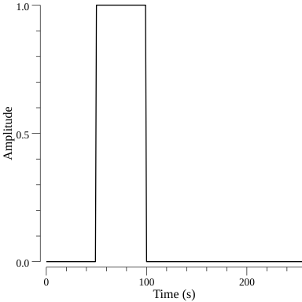
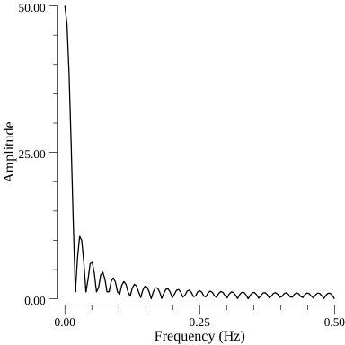
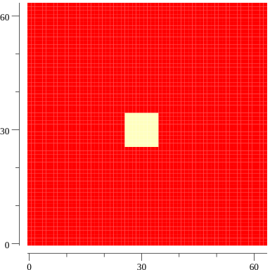
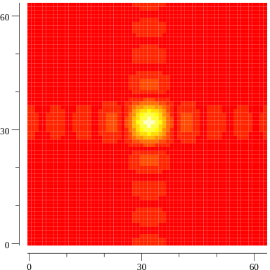
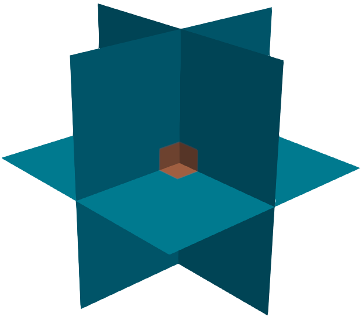
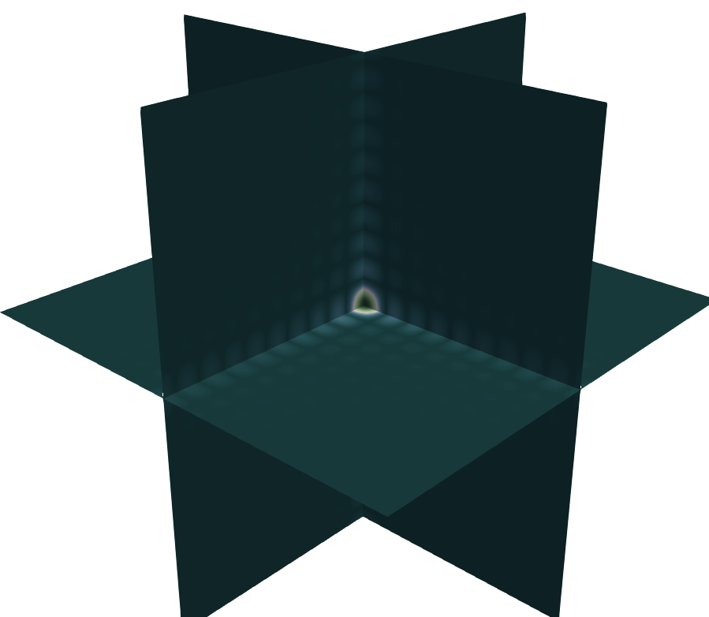

# gosfft

Simple FFT (SFFT) is a simple FFT library that is based on Gonum's FFT routine. It implements a simple interface for 1D, 2D and 3D transforms.

# Examples

Below is a selection of examples whoen

## [1D fourier transform](examples/fft1d/main.go)

Fourier transform of a square pulse

 

## [2D fourier transform](examples/fft2d/main.go)

Fourier transform of a square

 

## [3D fourier transform](examples/fft3d/main.go)

Fourier transform of a 3D cube

    
    

## Parallelization
GOSFFT implements parallel versions of the multidimensional FFTs. In the following [testcase](cmd/gosfft-time-fft2/main.go) a 
2D 128 x 128 matrix is Fourier Transformed. The following results where obtained (Intel(R) Core(TM) i7-7700 CPU @ 3.60GHz)

| Number of workers | Execution time per FFT |
| ----------------- | ---------------------- |
| 1                 | 1.34 ms                |
| 2                 | 0.85 ms                |
| 4                 | 0.67 ms                |
| 8                 | 0.45 ms                |
